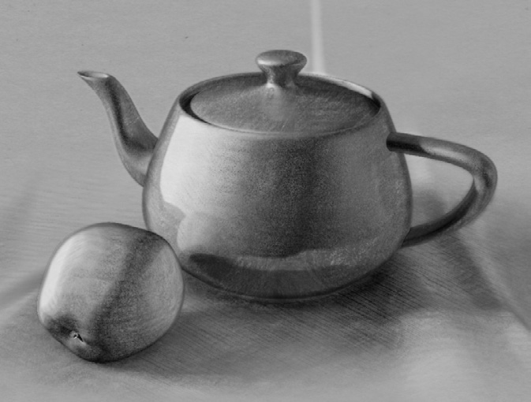
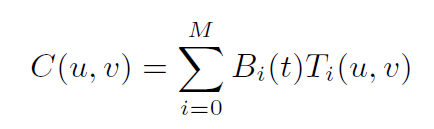
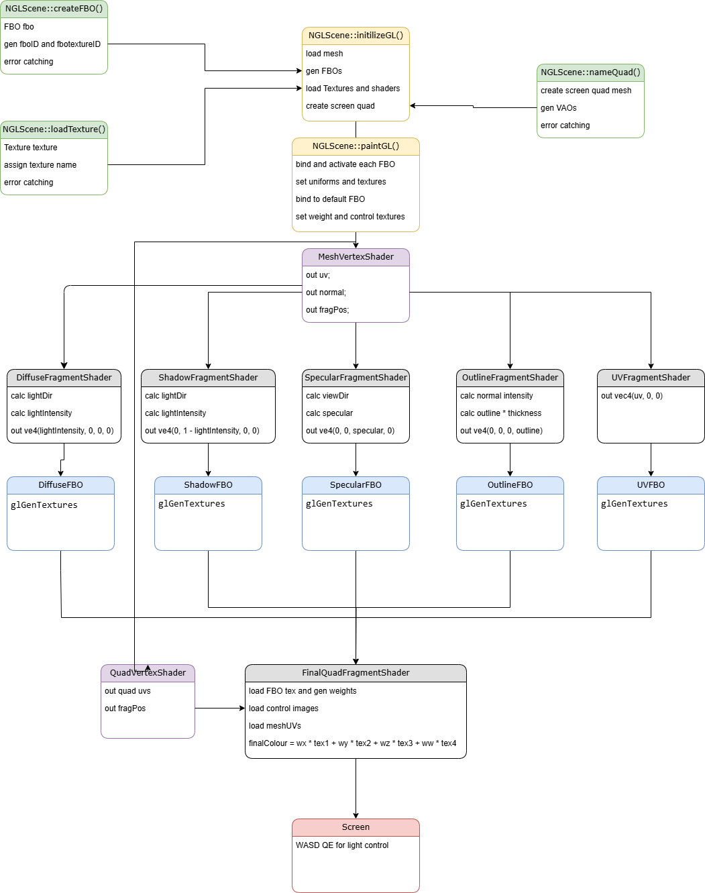

### Operating Instructions

The application is designed to be run from its /build folder.
After building the program run ./NPRRendering
The light position can be adjusted using WASD for x/y axis and QE for z-axis.
The viewport allows move around with mouse buttons. 

# NPR Rendering approach to charcoal shaders
 
I am interested in "painted-style" shaders and creating an NPR look. 

My initial idea for the project was developing a process that applies a procedural "painted" effect on the input mesh, so it can be used with any model. 

After doing some background research I found several approaches to how to acheve a similar result. For example in 2021 Moon, Reddy and Tychonievich used ray tracing to find where the objects are in the assembled 3D scene and then projected a brush "filter" based on the original pixel colour. At the same time, there are several papers by Akleman et al (2016a; 2016b; 2020) that looked into developing NPR shaders themselves, alternating the input textures with the use of barycentric shaders.

Given this research, I had several options regarding how I can implement the "effect": either as texture manipulation and shading or as a general post-processing effect on the scene. 

I thought that Akleman's and Du's approach from "Charcoal Rendering and Shading with Reflections" (2016a) was closest to what I had in mind. This method allows the developer to specify the shading parameters separately and, after confirming that they satisfy the partition of unity, blend the corresponding control textures, to achieve a reliable charcoal look. 

Hence, for my project I set out to attempt to recreate such approach and create a suitable rendering system, that would blend chosen control textures based on their corresponding parameters. This way the final colour of the pixel is controled by textures' intensity and influence rather than by the lighting model, maintaining the artistic style. 

# Design & Implementation

This application is designed around the idea of blending a precaclulated set of parameters. According to Akleman and Du (2016a), a part of the Barycentric shaders shading equation 

B(t_i) is a basis function that produces the weight for the texture, and t_i is one of the shading parameters (diffuse, ao, shadow, etc). This way each parameter presents a separate AOV with the purpose to be combined further down the pipeline. 

With this in mind, I decided to utilize the FBO functionality of OpenGL to generate the shading passes on their own and then combine them, before projecting on the final screen quad. This also opened the path for any post-processing effects, should I require them.

## Mesh

Initialy I have implemented a small addition to loadObj() function based on the NGL/ColourObj.cpp, that would create and load a set of barysentric coordinates assigned to each vertex. However, later this presented a problem, because without knowing the relation between the points this set of coordinated would compute on per triangle basis, instead of universally through the mesh. This setback pushed me towards the idea to mask the parameter I was trying to capture, basically to generate a custom map for each pass.

The geometry therefore doesnt need to be altered in any way, as long as it is a default .obj with uvs. 

## Textures 

I have opted to expand the NGLSCene class with a couple of functions, and one of them was the loadTexture() that took in the path to the image file, then created a ngl Texture object, set it in OpenGL and run some error checking in case there were issues, when loading the texture.
The textures I used in this project are the control images published in "Charcoal Rendering and Shading with Reflections" (Aklemand and Du, 2016a). All of them are loaded into the NGLScene for ease of testing and switching between them in shaders, though not all of them are used simultaneously. 

## FBOs 

I added an FBO struct to the class, and with its constrcutor generated a new FBO with fboID and fbotextureID avaialble to store and use later. I required an FBO for the each pass that I made, which had a lot of inflcuence on how I had to structure the code. 
In addition to the parameters' FBOs, I also had to pass down the UV FBO to enable the generated texture to be wrapt around the loaded mesh on the final screen quad. Simple error handling was added to confirm wether the FBO was created successfully or not.

## Shaders

Shaders were where most of the look calculation took place, so I required quite a few. At first, I started figuring out the blending by generating the custom texture maps and multiplying the masking logit in the respective shader. However, such blending produced very sharp refults with many pixels left out of influence. Akleman et al. (2016b) suggest "each parameter is created by a single front-end shader" and later describe how those parameters can be both colours and floats, because they only provide weight and not the control texture pass.

This made me reshuffle the shading logic: all shaders (exept for the final quad) share the meshvertex shader, that processes the geometry inputs, however the main pass calculation are made in the respective fragment shader. This way diffuse fragment shader computes the light intensity paramere that is then passed as the first element into a vec4 and rendered to the texture via the FBO. And so on for each shader. The exeption is the UV shader that similarly passes through the UV coordinate of the mesh, that has a slightly different purpose.

After this all of the generated FBO textures are loaded as unifroms into the FinalQuadFragmentShader and the parameter floats are extracted into new varialbes. 
Those variables are to act as weights for the textures, and ensuring that they are normalised, satisfy the partition of unity and the barycentric shading equation:

**vec3 blendtex = tex1 * wx + tex2 * wy + tex3 * wz + tex4 * ww;**

This combines all of the chosen textures in the respective proportions, and gives the final colour a blended result between the 4 passes.   

# Final Design 

Below is the diagram that describes the final design.

# Further Work

Unfortunately, I was not able to implement the chosen paper to the degree I wanted, though I believe that a shader relying on the universal control images to blend between the basic lighting is a good start and proof of concept. To develop it further, I aim to figure out how to incorporate a smoother gradient by using more textures. Probably, I could calculate the falloff on the each of the parameters and then set the thresholds for when the diffuse texture should be sampled from diffuse_control1, or diffuse_control2 or diffuse_control3. This could bring a smoother appreance and bigger tone variety, which it prevalent in the actual charcoal drawing. 

Another improvement will be an ability for the shader to calculate global refelctions, that will help to integrate multible objects together. For that, I would set up a larger scene with more components and work with catching the reflections from other surfaces.

As some further imporovements I can suggest for this project, are some quality of life controls for loading in different meshes and picking the control images without the need to hardcode it into the .cpp. This can be further implemented with control line arguments or, on a higher level, with Qt. Though this is a late stage improvement, it will make the application more user-friendly and will allow for more complex demonstrations. 

# Reference list 
1. Moon, N., Reddy, M., Tychnievich, L., 2021. *Non-Photorealistic Ray-tracing with Paint and Toon Shading*. SIGGRAPGH 2021. Available from: https://history.siggraph.org/wp-content/uploads/2022/08/2021-Poster-40-Moon_Non-photorealistic-ray-tracing-with-paint-and-toon-shading.pdf [Accessed 10 Nov. 2024].
2. Akleman, E., Du, Y., 2016. *Charcoal Rendering and Shading with Reflections*. SIGGRAPH 2016: Anaheim. Available from: https://history.siggraph.org/wp-content/uploads/2022/10/2016-Poster-05-Du_harcoal-Rendering-and-Shading-With-Reflections.pdf [Accessed 11 Nov. 2024].
3. Akleman, E., House, D., Liu, S., 2016. *Art Directed Rendering & Shading Using Control Images*. The Eurographics Association. Available from: https://dl.acm.org/doi/pdf/10.5555/2981324.2981331 [Accessed 9 Nov. 2024].
4. Akleman, E., Subramanian, M., 2020. *A Painterly Rendering Approach to Create Still-Life Paintings with Dynamic Lighting.* SIGGRAPH 2020. Available from: https://history.siggraph.org/wp-content/uploads/2022/09/2020-Poster-31-Subramanian_A-Painterly-Rendering-Approach.pdf [Accessed 10 Nov. 2024]
5. Shreiner, D., Sellers, G., Kessenich, J., Licea-Kane, B., 2013. *OpenGL programming guide : the official guide to learning OpenGL, version 4.3. Eighth edition.* Upper Saddle River, NJ: Addison-Wesley.
6. LearnOpenGL, 2024. *Basic Lighting*. Available from: https://learnopengl.com/Lighting/Basic-Lighting [Accessed 15 Dec. 2024].
7. LearnOpenGL, 2024. *Framebuffers*. Available from: https://learnopengl.com/Advanced-OpenGL/Framebuffers [Accessed 15 Dec. 2024].
7. docsGL, 2024. *OpenGL API Documentation*. Available from: https://docs.gl/ [Accessed 24 Dec. 2024].